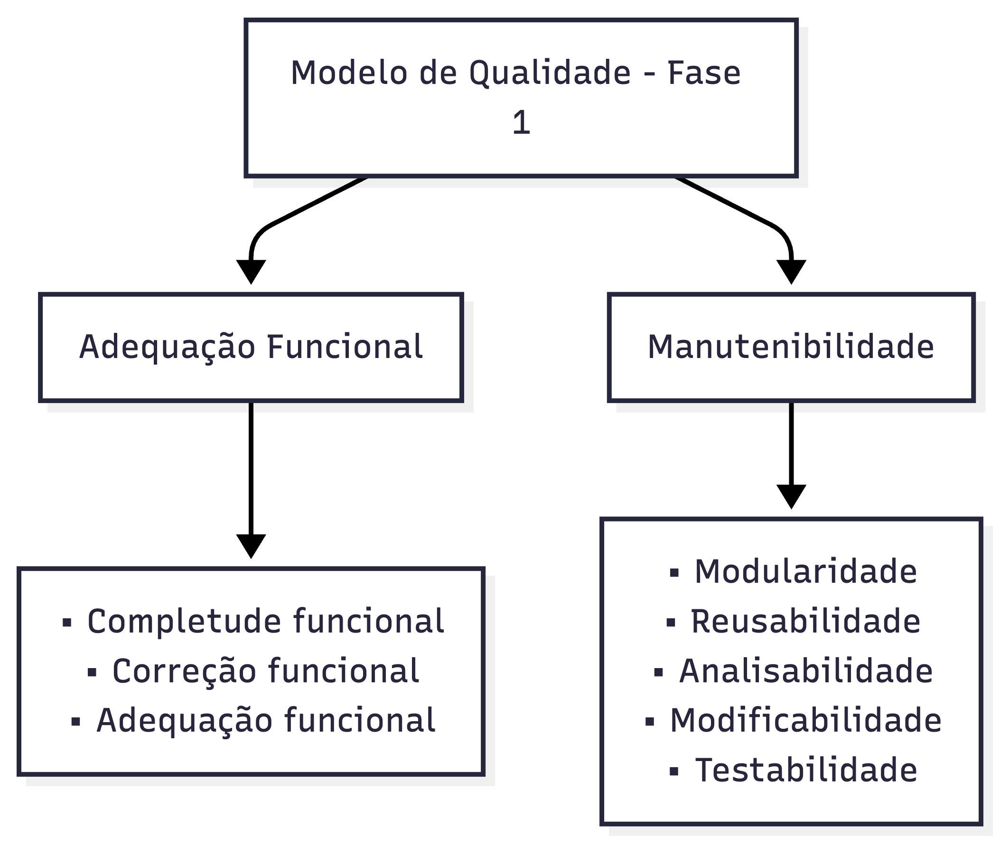

# Modelo de Qualidade

## 1. Introdução

**Objetivo:** Representar o modelo de qualidade (ISO/IEC 25010 - SQuaRE) com foco nas duas características prioritárias **Adequação Funcional** e **Manutenibilidade**, definindo o escopo e a profundidade de análise para cada uma no contexto do NoFluxoUNB.

**Contexto:** O NoFluxoUNB é uma plataforma SaaS de planejamento acadêmico interativo que integra parsing de PDFs de matrizes curriculares, algoritmos de matching de disciplinas, visualização de fluxogramas e cálculos acadêmicos com suporte a IA. Estas características prioritárias foram selecionadas para validar a integridade funcional de operações críticas e garantir a manutenibilidade em um ambiente multi-linguagem (TypeScript, Python, SQL).

---

## 2. Diagrama (visão geral)

Figura 1 - Diagrama adaptado do modelo ISO/IEC 25010.

---

## 3. Escopo

A avaliação será limitada às duas características para esta Fase 1: **Adequação Funcional** e **Manutenibilidade** — em conformidade com a ISO/IEC 25010. As demais características do modelo (p.ex. Usabilidade, Segurança, Portabilidade, Compatibilidade) ficam fora do escopo deste trabalho.

---

## 4. Critérios de Priorização

A seleção e priorização das características foi realizada utilizando uma matriz de **Impacto × Risco**, considerando:

- **Impacto:** Consequência da falha na vida do usuário final (aluno, coordenador, sistema acadêmico)
- **Risco:** Probabilidade ou frequência de ocorrência de problemas
- **Complexidade técnica:** Relação com a arquitetura multi-linguagem (TS, Python, SQL)
- **Alinhamento ao propósito:** Conexão direta com o objetivo de planejamento acadêmico

---

## 5. Adaptação do Modelo

O modelo padrão ISO/IEC 25010 foi adaptado para priorizar as características mais relevantes ao propósito desta avaliação. A tabela abaixo apresenta a priorização das oito características do modelo de acordo com os critérios definidos anteriormente, juntamente com a ênfase baseada na prioridade.

| Característica           |  Impacto   |    Risco    | Complexidade | Prioridade | Justificativa                                                                                                                        |
| :----------------------- | :--------: | :---------: | :----------: | :--------: | :----------------------------------------------------------------------------------------------------------------------------------- |
| Adequação Funcional      |  Crítico   |    Alto     |     Alta     |   **P1**   | Núcleo do produto: parsing, matching e cálculos impactam decisões acadêmicas. Falhas têm consequências diretas para estudantes.      |
| Eficiência de Desempenho |    Alto    |    Médio    |  Média-Alta  |     P2     | Relevante para responsividade em geração de fluxogramas e processamento de grandes PDFs; afeta experiência e escalabilidade.         |
| Compatibilidade          | Médio-Alto |    Médio    |    Média     |     P3     | Importante ao integrar com diferentes fontes de dados e consumidores (export/import), porém menos crítico que funcionalidade básica. |
| Usabilidade              |    Alto    | Baixo-Médio |    Média     |     P3     | Influencia adoção e corretude de uso, mas não bloqueia operações essenciais quando ausente.                                          |
| Confiabilidade           |  Crítico   |    Alto     |     Alta     |   **P1**   | Necessária para assegurar integridade dos dados e operação consistente (tolerância a falhas, recuperação).                           |
| Segurança                |  Crítico   | Médio-Alto  |     Alta     |     P2     | Proteção de dados pessoais e integridade — essencial, porém parte pode ser mitigada em fases posteriores.                            |
| Manutenibilidade         |    Alto    | Médio-Alto  |     Alta     |   **P1**   | Sustentabilidade do projeto: facilidade de alterar regras acadêmicas e adicionar cursos sem regressões.                              |
| Portabilidade            |   Médio    |    Baixo    |    Média     |     P3     | Facilita deploys em diferentes ambientes, mas não é requisito imediato para correção funcional.                                      |

---

## Tabela de Ênfase por Priorização

| Característica           | Prioridade | Ênfase (1 a 5) |
| ------------------------ | :--------: | :------------: |
| Adequação Funcional      |     P1     |       5        |
| Confiabilidade           |     P1     |       5        |
| Manutenibilidade         |     P1     |       5        |
| Eficiência de Desempenho |     P2     |       4        |
| Segurança                |     P2     |       4        |
| Compatibilidade          |     P3     |       3        |
| Portabilidade            |     P3     |       3        |
| Usabilidade              |     P3     |       4        |

---

## 6. Características Selecionadas

Foram selecionadas duas características de qualidade de software, descritas a seguir:

---

### 6.1 Adequação Funcional

**Definição:** Refere-se à capacidade do NoFluxoUNB de executar as operações acadêmicas principais (parsing de PDFs, matching de disciplinas, cálculos de equivalência, visualização de fluxograma) de forma completa, correta e adequada ao contexto de planejamento acadêmico, sem provocar erros, inconsistências ou perda de integridade dos dados.
**Subcaracterísticas:**

1. **Completude Funcional:** O sistema executa completamente todas as operações acadêmicas necessárias. Falhas de completude comprometem a confiança do estudante e podem levar a decisões acadêmicas incorretas.

2. **Correção Funcional:** As operações produzem resultados precisos e confiáveis. Erros de correção podem resultar em rejeição de matrículas, aprovações falsas ou reprovações incorretas.

3. **Adequação Funcional:** As funcionalidades estão alinhadas com as regras e normas acadêmicas da UnB. Funções bem-sucedidas mas fora das normas comprometem a legalidade dos processos.

---

### 6.2 Manutenibilidade

**Definição:** Refere-se à capacidade do código-base do NoFluxoUNB ser compreendido, modificado, testado e estendido de forma eficiente, considerando a complexidade de múltiplas linguagens (TypeScript, Python, SQL) e a necessidade de adaptar o sistema para novas matrizes curriculares e regras acadêmicas.
**Subcaracterísticas:**

1. **Modularidade:** O código está organizado em componentes independentes e bem-delimitados. Modularidade fraca facilita a propagação de bugs e dificulta testes isolados.

2. **Reusabilidade:** Funções, bibliotecas e componentes podem ser reutilizados em diferentes contextos sem duplicação. Reusabilidade baixa leva a código duplicado e aumento de esforço de manutenção.

3. **Analisabilidade:** O código é fácil de analisar, entender e diagnosticar problemas. Analisabilidade baixa aumenta o tempo de debug e o risco de regressão inadvertida.

4. **Modifiabilidade:** Alterações em regras de negócio, adição de novos cursos ou mudanças em PDFs requerem mínimo esforço e impacto. Modifiabilidade fraca causa regressões e impossibilita evolução do sistema.

5. **Testabilidade:** O código é estruturado para facilitar testes automatizados em todos os níveis. Testabilidade baixa impede detecção precoce de defeitos e aumenta risco de regressões em produção.

---

## 7. Relação entre as Características

As duas características escolhidas são complementares e formam o alicerce de qualidade do NoFluxoUNB:

- **Adequação Funcional** valida o "o quê": as operações acadêmicas são executadas corretamente.
- **Manutenibilidade** valida o "como": o código pode ser mantido, evoluído e confiado para suportar mudanças futuras.

### 7.1 Justificativa por Stakeholders

**Estudantes:** Dependem de Adequação Funcional para tomar decisões acadêmicas corretas (matrícula, trancamento, etc.). Caso o sistema falhe em parsing, matching ou cálculos, o estudante corre o risco de perder semestres ou não progredir no curso. Manutenibilidade garante que o sistema continuará confiável quando novas matrizes ou regras forem adicionadas (novos cursos, reforma curricular).

**Coordenadores/Departamentos Acadêmicos:** Confiam em Adequação Funcional para auditar integralizações, validar equivalências e garantir conformidade com normas da UnB. Manutenibilidade é essencial para adaptar o sistema rapidamente a mudanças regulatórias ou de política acadêmica sem comprometer a confiança em dados já processados.

**Desenvolvedores/Equipe Técnica:** Precisam de Adequação Funcional como base de validação (testes de aceitação). Manutenibilidade permite que novos desenvolvedores entendam o código, corrijam defeitos e implementem novas funcionalidades sem introduzir regressões, reduzindo tempo e custo de iterações.

**Sistema Acadêmico UnB (Integração):** Depende de Adequação Funcional para consumir dados consistentes do NoFluxoUNB (scores, equivalências, integralizações). Manutenibilidade garante que o NoFluxoUNB pode ser atualizado sem quebrar contratos de integração ou expor dados com inconsistências.

Juntas, elas fornecem confiança de que o NoFluxoUNB não apenas funciona corretamente hoje, mas permanecerá confiável, adaptável e sustentável conforme novas matrizes e regras acadêmicas forem integradas ao longo do ciclo de vida do projeto.

---

## 8. Referências Bibliográficas

> 1. ISO/IEC 25010:2023. Características e subcaracterísticas de qualidade de software. Disponível em: https://www.iso.org/standard/82998.html. Acesso em: 2026.

> 2. SILVA, E.; TAVARES, T. _Avaliação de Qualidade de Software com ISO/IEC 25010_. Métodos e Boas Práticas, 2024.

> 3. UNB-MDS. 2025-1-NoFluxoUNB. [S. l.], 2025. Disponível em: https://github.com/unb-mds/2025-1-NoFluxoUNB. Acesso em: 12/05/2026.

---

## **Histórico de Versão**

| Versão | Data       | Descrição                                                                              | Autor(es)                                                     | Revisor(es) | Data de Revisão | Alterações Realizadas |
| ------ | ---------- | -------------------------------------------------------------------------------------- | ------------------------------------------------------------- | ----------- | --------------- | --------------------- |
| 1.0    | 12/05/2026 | Criação da estrutura do Modelo de Qualidade com Adequação Funcional e Manutenibilidade | [Matheus de Alcântara](https://github.com/matheusdealcantara) |             |                 |                       |
| 1.1    | 13/05/2026 | Revisão e ajustes na definição das características e subcaracterísticas                | [Matheus de Alcântara](https://github.com/matheusdealcantara) |             |                 |                       |
