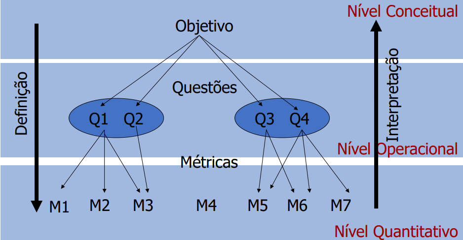

# Sobre a Fase 2

## Introdução

Nesta etapa, adotou-se a abordagem GQM (Goal-Question-Metric), que permite traduzir objetivos de qualidade em questões específicas e métricas mensuráveis, garantindo uma análise prática e estruturada da qualidade do software do software NoFluxoUNB

## Sobre o GQM 

O Goal-Question-Metric (GQM) é uma abordagem sistemática para definir e integrar objetivos a modelos de
processo, produto e perspectivas de qualidades baseada em necessidades específicas do projeto e organizações através de um programa de medições. Seu objetivo é coletar toda a informação necessária para o programa de métricas, preparar e motivar membros da organização, definir objetivos, cronogramas e responsabilidades.

Conforme ilustrado na Figura 1, o GQM estabelece um fluxo hierárquico top-down (de cima para baixo), que conecta os objetivos estratégicos aos dados coletados:

- Nível Conceitual (Goal / Objetivo): É o nível mais alto; define o porquê da medição. Estabelece o objetivo principal que se deseja alcançar. Envolvem produtos, processos e ou recursos;

- Nível Operacional (Question / Questão): Detalha o que precisamos saber para determinar se a meta foi atingida. São criadas perguntas que tentam caracterizar o objeto de medição no contexto da questão da qualidade a partir de uma determinada perspectiva;

- Nível Quantitativo (Metric / Métrica): É a base do processo; define como vamos medir. São as métricas que fornecem os dados quantitativos necessários para responder objetivamente a cada questão.

Figura 1 - Modelo de GQM.

 Fonte: Soares Ramos (2026). <a href="https://fcte-qualidade-de-software-1.github.io/2026-1_T02_CAROL_SHAW/fase2/introducao/referencias">[2]</a> 

## Referências

> 1. D. C. de Moura, P. Nery, C. V. P. da Silva e D. de C. Campos, "GQM: Goal – Question - Metric", Centro de Informática, Universidade Federal de Pernambuco (UFPE), Recife, 2009. [Online]. Disponível em: https://www.cin.ufpe.br/~scbs/metricas/seminarios/GQM_texto.pdf. Acesso em: 4 jun. 2026.

> 2. SOARES RAMOS, Cristiane. Abordagens de Medição - GQM. Brasília: UnB, 2026. Material de aula (slides). Acesso em: 04/06/2026

## Histórico de Versões

| Versão | Data       | Descrição                      | Autor(es)                                                     | Revisor(es) | Data de Revisão | Alterações Realizadas |
| ------ | ---------- | ------------------------------ | ------------------------------------------------------------- | ----------- | --------------- | --------------------- |
| 1.0    | 04/06/2026 | Criação da documentação inicial e estruturação | [Vilmar José Fagundes](https://github.com/VilmarFagundes) |  |  |  |