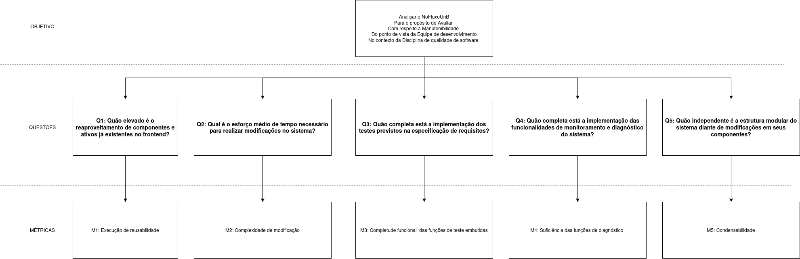

# Manutenibilidade

## Objetivo 

| Dimensão | Descrição |
|----------|-----------|
| Analisar | O NoFluxoUnB|
| Para o propósito de| Avaliar|
| Com respeito a| Manutenibilidade|
| Do ponto de vista de| Equipe de desenvolvimento|
| No contexto da| Disciplina de Qualidade de Software|

## Questões, Hipóteses e  Métricas

### Q1: Quão elevado é o reaproveitamento de componentes e ativos já existentes no frontend?

#### H1: Espera-se que o NoFluxoUnB apresente um alto grau de reaproveitamento de componentes e ativos no frontend.

#### Métrica 1: Execução de reusabilidade
Fórmula:
$$
\frac{\text{Ativos Reutilizados}}{\text{Total de Ativos}} \times 100
$$

Critérios:

- Desejável (H1 Confirmada): ≥ 80%

- Aceitável: Entre 50% e 79%

- Inaceitável (H1 Refutada): < 50%

---

### Q2: Qual é o esforço médio de tempo necessário para realizar modificações no sistema?

#### H2: Espera-se que a equipe do NoFluxoUnB leve, em média, menos de 4 horas úteis para realizar uma modificação no sistema.

#### Métrica 2: Complexidade de modificação
Fórmula:
$$
\frac{\text{Tempo Total de Trabalho}}{\text{Número de Modificações}}
$$

Critérios:

- Desejável (H2 Confirmada): ≤ 4 horas por modificação

- Aceitável: Entre 4 e 8 horas por modificação

- Inaceitável (H2 Refutada): > 8 horas por modificação

---

### Q3: Quão completa está a implementação dos testes previstos na especificação de requisitos?

#### H3: Espera-se que a equipe tenha implementado 100% dos cenários de teste definidos na especificação dos requisitos da aplicação.

#### Métrica 3: Completude funcional das funções de teste embutidas
Fórmula:
$$
\frac{\text{Testes Implementados}}{\text{Testes Requeridos na Especificação}} \times 100
$$

Critérios:

- Desejável (H3 Confirmada): 100%

- Aceitável: Entre 80% e 99%

- Inaceitável (H3 Refutada): < 80%

---

### Q4: Quão completa está a implementação das funcionalidades de monitoramento e diagnóstico do sistema?

#### H4: Espera-se que o NoFluxoUnB implemente integralmente as funcionalidades de diagnóstico, rastreamento de erros e monitoramento previstas no projeto.

#### Métrica 4: Suficiência das funções de diagnóstico
Fórmula:
$$
\frac{\text{Funções de Diagnóstico Implementadas}}{\text{Funções Exigidas na Especificação}} \times 100
$$

Critérios:

- Desejável (H4 Confirmada): 100%

- Aceitável: Entre 80% e 99%

- Inaceitável (H4 Refutada): < 80%

### Q5: Quão independente é a estrutura modular do sistema diante de modificações em seus componentes?

#### H5: Espera-se que o NoFluxoUnB possua alta modularidade, de modo que alterações em um componente tenham impacto mínimo nos demais.

#### Métrica 5: Condensabilidade
Fórmula:
$$
\frac{\text{Componentes não impactados por mudanças em outros}}{\text{Total de Componentes}} \times 100
$$

Critérios:

- Desejável (H5 Confirmada): ≥ 80%

- Aceitável: Entre 50% e 79%

- Inaceitável (H5 Refutada): < 50%

## Modelo GQM

<figure markdown>

<figcaption>

<b>Figura 1 – GQM de Manutenibilidade</b>
 
Fonte: Isaque Camargos, 2026.

</figcaption>
</figure>

## Referências Bibliográficas

> 1. ISO/IEC 25010:2023. Características e subcaracterísticas de qualidade de software. Disponível em: https://www.iso.org/standard/82998.html. Acesso em: 4 de junho de 2026.

> 2. SOARES RAMOS, Cristiane. Processo de Avaliação de Qualidade de Software. Brasília: UnB, 2026. Material de aula (slides). Acesso em: 12/05/2026

> 3. UNB-MDS. 2025-1-NoFluxoUNB. [S. l.], 2025. Disponível em: https://github.com/unb-mds/2025-1-NoFluxoUNB. Acesso em: 12/05/2026.

> 4. ISO; IEC. Systems and software engineering – Systems and software Quality Requirements and Evaluation (SQuaRE) – Measurement of system and software product quality. ISO/IEC WD 25023. Working Draft, Geneva: International Organization for Standardization; International Electrotechnical Commission, 2011. 29 p. Acesso em: 12/05/2026.

## Histórico de Versões

| Versão | Data       | Descrição                      | Autor(es)                                                     | Revisor(es) | Data de Revisão | Alterações Realizadas |
| ------ | ---------- | ------------------------------ | ------------------------------------------------------------- | ----------- | --------------- | --------------------- |
| 1.0    | 04/06/2026 | Criação da documentação inicial e estruturação | [Vilmar José Fagundes](https://github.com/VilmarFagundes) |  |  |  |
| 1.1    | 04/06/2026 | Escrita de todo o documento | [Isaque Camargos Nascimento](https://github.com/isaqzin) |  |  |  |
