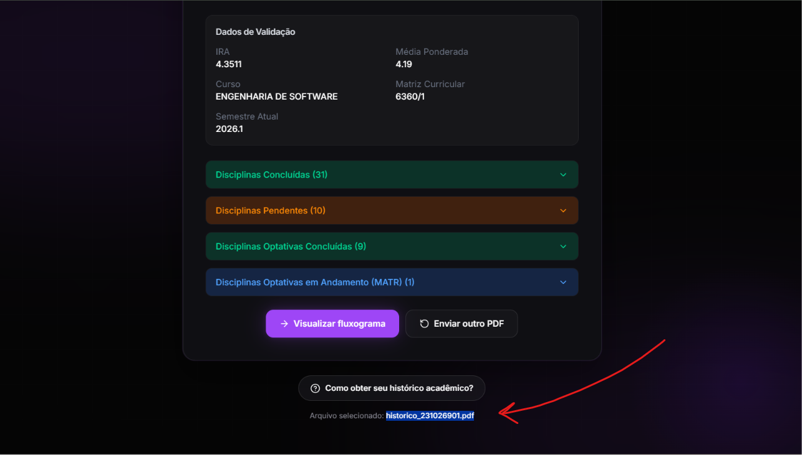
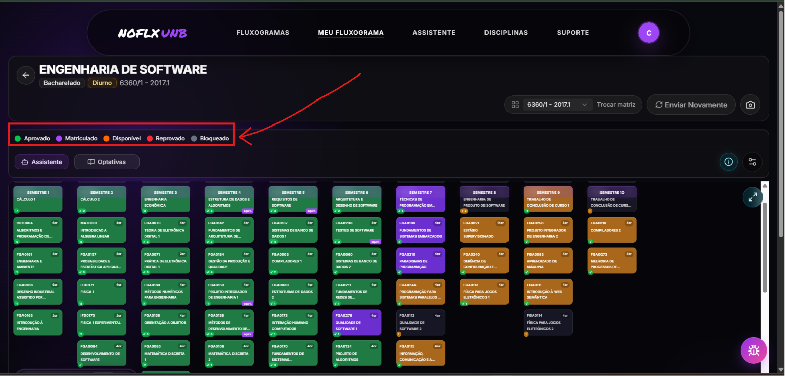
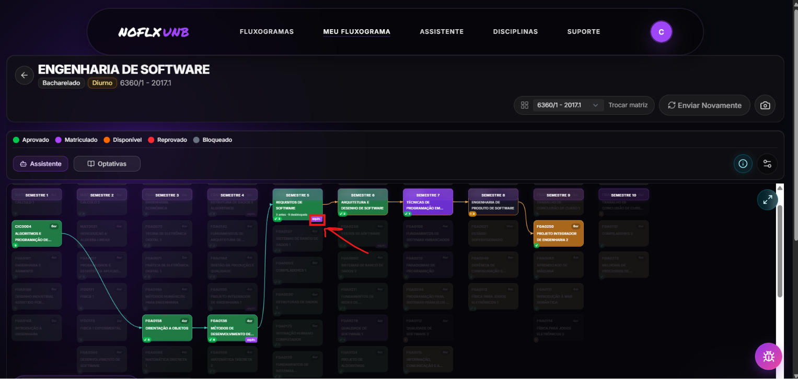
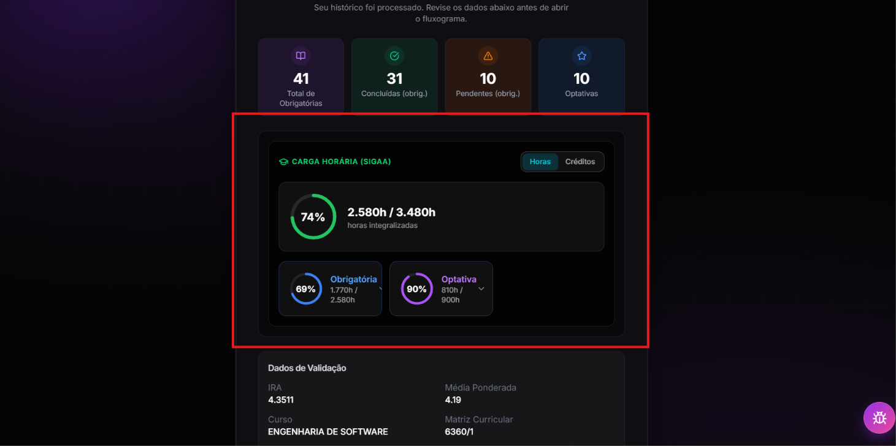
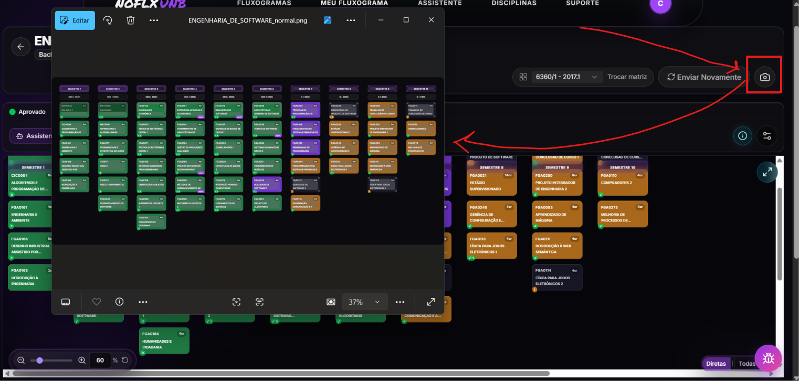
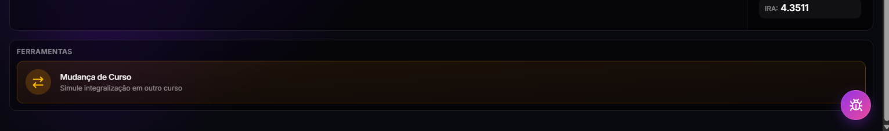
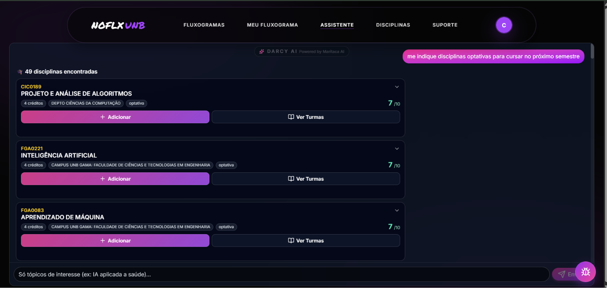

# Evidência da CRF

## 1. Critério de Avaliação

Os requisitos foram obtidos do documento [`documentacao/planejamento/Requivitos/requisitos.md`](https://github.com/unb-mds/2025-1-NoFluxoUNB/blob/ba6db878b9dfa36fb034916612c4cf58ddf43475/documentacao/planejamento/Requivitos/requisitos.md), no commit [`ba6db878b9dfa36fb034916612c4cf58ddf43475`](https://github.com/unb-mds/2025-1-NoFluxoUNB/commit/ba6db878b9dfa36fb034916612c4cf58ddf43475). A avaliação abrange os 15 requisitos funcionais de primeiro nível. Requisitos com implementação parcial foram classificados como **ausentes/incorretos**, em conformidade com o método definido na Fase 3.

### 1.1 Atomicidade dos requisitos

Parte dos requisitos agrega mais de um comportamento verificável. Essa estrutura limita a objetividade da classificação binária, pois um mesmo requisito pode reunir capacidades implementadas e não implementadas.

| Requisito | Capacidades agregadas |
| :-------- | :-------------------- |
| RF05 | Mostrar o fluxograma, destacar disciplinas cursadas, apresentar equivalências e informar tentativas ou reprovações |
| RF07 | Calcular e exibir IRA e média ponderada |
| RF08 | Identificar e exibir horas complementares cumpridas e pendentes |
| RF11 | Armazenar dados do usuário e simulações anteriores |
| RF12 | Exibir semestres cursados e restantes com base no tempo máximo |
| RF13 | Identificar ocorrência, quantidade e períodos de trancamento |
| RF14 | Identificar mudança de curso, curso anterior, data e disciplinas aproveitadas |
| RF15 | Recomendar cursos e disciplinas com base em interesse, histórico e preferências |

Tabela 1 - Exemplos de requisitos funcionais não atômicos. Fonte: Caio Duarte e Gabriel Flores, 2026.

O RF05 evidencia essa limitação: a apresentação do fluxograma, o destaque das disciplinas cursadas e a exibição das equivalências possuem evidências de implementação, enquanto a quantidade de tentativas ou reprovações permanece ausente. Como a unidade de contagem da CRF é o requisito completo, o RF05 foi classificado como **ausente/incorreto**.

O cálculo foi mantido sobre os 15 requisitos de primeiro nível para preservar a rastreabilidade com as Fases 2 e 3. A medida resultante representa, portanto, a proporção de requisitos integralmente atendidos. Uma medição baseada em capacidades atômicas exigiria a revisão prévia da especificação e produziria um denominador distinto.

---

## 2. Matriz de Rastreabilidade

| ID | Requisito resumido | Situação | Evidências principais | Justificativa |
| :- | :----------------- | :------- | :-------------------- | :------------ |
| RF01 | Login e salvamento de simulações | Implementado | [`auth.service.ts`](https://github.com/unb-mds/2025-1-NoFluxoUNB/blob/ba6db878b9dfa36fb034916612c4cf58ddf43475/no_fluxo_frontend_svelte/src/lib/services/auth.service.ts); [`fluxograma.store.svelte.ts`](https://github.com/unb-mds/2025-1-NoFluxoUNB/blob/ba6db878b9dfa36fb034916612c4cf58ddf43475/no_fluxo_frontend_svelte/src/lib/stores/fluxograma.store.svelte.ts); [`supabase-data.service.ts`](https://github.com/unb-mds/2025-1-NoFluxoUNB/blob/ba6db878b9dfa36fb034916612c4cf58ddf43475/no_fluxo_frontend_svelte/src/lib/services/supabase-data.service.ts); [Figura 1](#figura-rf01) | Há autenticação por senha e Google, além da persistência do fluxograma e do planejamento do usuário. |
| RF02 | Upload de histórico em PDF | Implementado | [`upload-historico/+page.svelte`](https://github.com/unb-mds/2025-1-NoFluxoUNB/blob/ba6db878b9dfa36fb034916612c4cf58ddf43475/no_fluxo_frontend_svelte/src/routes/upload-historico/%2Bpage.svelte); [`FileDropzone.svelte`](https://github.com/unb-mds/2025-1-NoFluxoUNB/blob/ba6db878b9dfa36fb034916612c4cf58ddf43475/no_fluxo_frontend_svelte/src/lib/components/upload/FileDropzone.svelte); [`pdfParser.ts`](https://github.com/unb-mds/2025-1-NoFluxoUNB/blob/ba6db878b9dfa36fb034916612c4cf58ddf43475/no_fluxo_frontend_svelte/src/lib/services/pdf/pdfParser.ts); [Figura 2](#figura-rf02-rf03) | A interface aceita arquivos PDF, valida o formato e inicia seu processamento. |
| RF03 | Identificar disciplinas cursadas, aprovadas e reprovadas | Implementado | [`pdfDataExtractor.ts`](https://github.com/unb-mds/2025-1-NoFluxoUNB/blob/ba6db878b9dfa36fb034916612c4cf58ddf43475/no_fluxo_frontend_svelte/src/lib/services/pdf/pdfDataExtractor.ts); [`pdfParser.ts`](https://github.com/unb-mds/2025-1-NoFluxoUNB/blob/ba6db878b9dfa36fb034916612c4cf58ddf43475/no_fluxo_frontend_svelte/src/lib/services/pdf/pdfParser.ts); [`user.ts`](https://github.com/unb-mds/2025-1-NoFluxoUNB/blob/ba6db878b9dfa36fb034916612c4cf58ddf43475/no_fluxo_frontend_svelte/src/lib/types/user.ts); [Figuras 2 e 3](#figura-rf02-rf03) | O parser extrai as disciplinas e preserva situações acadêmicas como `APR`, `CUMP`, `REP`, `REPF` e `REPMF`. |
| RF04 | Consultar fluxograma e equivalências no banco | Implementado | [`supabase-data.service.ts`](https://github.com/unb-mds/2025-1-NoFluxoUNB/blob/ba6db878b9dfa36fb034916612c4cf58ddf43475/no_fluxo_frontend_svelte/src/lib/services/supabase-data.service.ts); [`upload.service.ts`](https://github.com/unb-mds/2025-1-NoFluxoUNB/blob/ba6db878b9dfa36fb034916612c4cf58ddf43475/no_fluxo_frontend_svelte/src/lib/services/upload.service.ts); [`fluxograma.service.ts`](https://github.com/unb-mds/2025-1-NoFluxoUNB/blob/ba6db878b9dfa36fb034916612c4cf58ddf43475/no_fluxo_frontend_svelte/src/lib/services/fluxograma.service.ts); [Figura 4](#figura-rf04-rf05) | Há consultas ao Supabase para matrizes, componentes curriculares, pré-requisitos, equivalências e procedimentos de correspondência. |
| RF05 | Mostrar fluxograma, cursadas, equivalências e quantidade de tentativas/reprovações | Ausente/incorreto | [`SubjectCard.svelte`](https://github.com/unb-mds/2025-1-NoFluxoUNB/blob/ba6db878b9dfa36fb034916612c4cf58ddf43475/no_fluxo_frontend_svelte/src/lib/components/fluxograma/SubjectCard.svelte); [`SubjectDetailsModal.svelte`](https://github.com/unb-mds/2025-1-NoFluxoUNB/blob/ba6db878b9dfa36fb034916612c4cf58ddf43475/no_fluxo_frontend_svelte/src/lib/components/fluxograma/SubjectDetailsModal.svelte); [rotas `meu-fluxograma`](https://github.com/unb-mds/2025-1-NoFluxoUNB/tree/ba6db878b9dfa36fb034916612c4cf58ddf43475/no_fluxo_frontend_svelte/src/routes/meu-fluxograma); [Figuras 3 e 4](#figura-rf03-rf05) | O fluxograma, as situações acadêmicas e as equivalências são exibidos, mas não há contagem de tentativas ou reprovações. |
| RF06 | Calcular e exibir porcentagem de conclusão | Implementado | [`upload.service.ts`](https://github.com/unb-mds/2025-1-NoFluxoUNB/blob/ba6db878b9dfa36fb034916612c4cf58ddf43475/no_fluxo_frontend_svelte/src/lib/services/upload.service.ts); [`ProgressSummarySection.svelte`](https://github.com/unb-mds/2025-1-NoFluxoUNB/blob/ba6db878b9dfa36fb034916612c4cf58ddf43475/no_fluxo_frontend_svelte/src/lib/components/fluxograma/ProgressSummarySection.svelte); [Figura 5](#figura-rf06) | O percentual é calculado e apresentado no resumo de progresso. |
| RF07 | Calcular e exibir IRA e média ponderada | Implementado | [`pdfDataExtractor.ts`](https://github.com/unb-mds/2025-1-NoFluxoUNB/blob/ba6db878b9dfa36fb034916612c4cf58ddf43475/no_fluxo_frontend_svelte/src/lib/services/pdf/pdfDataExtractor.ts); [`ProcessingResults.svelte`](https://github.com/unb-mds/2025-1-NoFluxoUNB/blob/ba6db878b9dfa36fb034916612c4cf58ddf43475/no_fluxo_frontend_svelte/src/lib/components/upload/ProcessingResults.svelte); [`ProgressSummarySection.svelte`](https://github.com/unb-mds/2025-1-NoFluxoUNB/blob/ba6db878b9dfa36fb034916612c4cf58ddf43475/no_fluxo_frontend_svelte/src/lib/components/fluxograma/ProgressSummarySection.svelte); [Figura 6](#figura-rf07) | Os dois indicadores são extraídos e apresentados na interface. |
| RF08 | Exibir horas complementares cumpridas e pendentes | Implementado | [`integralizacao.service.ts`](https://github.com/unb-mds/2025-1-NoFluxoUNB/blob/ba6db878b9dfa36fb034916612c4cf58ddf43475/no_fluxo_frontend_svelte/src/lib/services/integralizacao.service.ts); [`CargaHorariaDashboard.svelte`](https://github.com/unb-mds/2025-1-NoFluxoUNB/blob/ba6db878b9dfa36fb034916612c4cf58ddf43475/no_fluxo_frontend_svelte/src/lib/components/fluxograma/CargaHorariaDashboard.svelte) | A integralização distingue a carga horária realizada, exigida e pendente, incluindo a categoria complementar. |
| RF09 | Gerar PDF da simulação | Ausente/incorreto | [`screenshot.ts`](https://github.com/unb-mds/2025-1-NoFluxoUNB/blob/ba6db878b9dfa36fb034916612c4cf58ddf43475/no_fluxo_frontend_svelte/src/lib/utils/screenshot.ts); [`FluxogramaHeader.svelte`](https://github.com/unb-mds/2025-1-NoFluxoUNB/blob/ba6db878b9dfa36fb034916612c4cf58ddf43475/no_fluxo_frontend_svelte/src/lib/components/fluxograma/FluxogramaHeader.svelte); [`ScreenshotChoiceModal.svelte`](https://github.com/unb-mds/2025-1-NoFluxoUNB/blob/ba6db878b9dfa36fb034916612c4cf58ddf43475/no_fluxo_frontend_svelte/src/lib/components/fluxograma/ScreenshotChoiceModal.svelte); [Figura 7](#figura-rf09) | A funcionalidade disponível captura e exporta a simulação em PNG, e não em PDF. |
| RF10 | Simular troca de curso e aproveitamento | Implementado | [`MudancaCursoModal.svelte`](https://github.com/unb-mds/2025-1-NoFluxoUNB/blob/ba6db878b9dfa36fb034916612c4cf58ddf43475/no_fluxo_frontend_svelte/src/lib/components/fluxograma/MudancaCursoModal.svelte); [rota `meu-fluxograma/[courseName]`](https://github.com/unb-mds/2025-1-NoFluxoUNB/tree/ba6db878b9dfa36fb034916612c4cf58ddf43475/no_fluxo_frontend_svelte/src/routes/meu-fluxograma/%5BcourseName%5D); [`integralizacao.service.ts`](https://github.com/unb-mds/2025-1-NoFluxoUNB/blob/ba6db878b9dfa36fb034916612c4cf58ddf43475/no_fluxo_frontend_svelte/src/lib/services/integralizacao.service.ts); [Figura 8](#figura-rf10) | Há seleção do curso de destino e recálculo da integralização com base nas equivalências. |
| RF11 | Armazenar dados do usuário e simulações anteriores | Implementado | [`supabase-data.service.ts`](https://github.com/unb-mds/2025-1-NoFluxoUNB/blob/ba6db878b9dfa36fb034916612c4cf58ddf43475/no_fluxo_frontend_svelte/src/lib/services/supabase-data.service.ts); [`latest_init_from_export.sql`](https://github.com/unb-mds/2025-1-NoFluxoUNB/blob/ba6db878b9dfa36fb034916612c4cf58ddf43475/no_fluxo_backend/docs/supabase_migrations/latest_init_from_export.sql) | O estado atual é atualizado em `dados_users`, e cada envio pode ser registrado em `historicos_usuarios`. |
| RF12 | Exibir semestres cursados e restantes pelo tempo máximo | Ausente/incorreto | [`pdfDataExtractor.ts`](https://github.com/unb-mds/2025-1-NoFluxoUNB/blob/ba6db878b9dfa36fb034916612c4cf58ddf43475/no_fluxo_frontend_svelte/src/lib/services/pdf/pdfDataExtractor.ts); [`ProgressSummarySection.svelte`](https://github.com/unb-mds/2025-1-NoFluxoUNB/blob/ba6db878b9dfa36fb034916612c4cf58ddf43475/no_fluxo_frontend_svelte/src/lib/components/fluxograma/ProgressSummarySection.svelte) | O semestre atual é extraído e exibido, mas não há cálculo dos semestres restantes nem utilização do prazo máximo do curso. |
| RF13 | Identificar e exibir trancamentos | Ausente/incorreto | [`pdfDataExtractor.ts`](https://github.com/unb-mds/2025-1-NoFluxoUNB/blob/ba6db878b9dfa36fb034916612c4cf58ddf43475/no_fluxo_frontend_svelte/src/lib/services/pdf/pdfDataExtractor.ts); [`uploadStore.ts`](https://github.com/unb-mds/2025-1-NoFluxoUNB/blob/ba6db878b9dfa36fb034916612c4cf58ddf43475/no_fluxo_frontend_svelte/src/lib/stores/uploadStore.ts); [`supabase-data.service.ts`](https://github.com/unb-mds/2025-1-NoFluxoUNB/blob/ba6db878b9dfa36fb034916612c4cf58ddf43475/no_fluxo_frontend_svelte/src/lib/services/supabase-data.service.ts) | Os períodos de suspensão são extraídos e armazenados, porém não são apresentados ao usuário. |
| RF14 | Identificar mudança de curso ocorrida e aproveitamentos | Ausente/incorreto | [`user.ts`](https://github.com/unb-mds/2025-1-NoFluxoUNB/blob/ba6db878b9dfa36fb034916612c4cf58ddf43475/no_fluxo_frontend_svelte/src/lib/types/user.ts); [`supabase-data.service.ts`](https://github.com/unb-mds/2025-1-NoFluxoUNB/blob/ba6db878b9dfa36fb034916612c4cf58ddf43475/no_fluxo_frontend_svelte/src/lib/services/supabase-data.service.ts); [componentes de fluxograma](https://github.com/unb-mds/2025-1-NoFluxoUNB/tree/ba6db878b9dfa36fb034916612c4cf58ddf43475/no_fluxo_frontend_svelte/src/lib/components/fluxograma) | Não foram identificados campos ou fluxo funcional para registrar o curso anterior, a data da mudança e os componentes aproveitados em uma mudança já ocorrida. |
| RF15 | Recomendação de cursos e disciplinas baseada em interesse, histórico e preferências | Ausente/incorreto | [`assistente/+page.svelte`](https://github.com/unb-mds/2025-1-NoFluxoUNB/blob/ba6db878b9dfa36fb034916612c4cf58ddf43475/no_fluxo_frontend_svelte/src/routes/assistente/%2Bpage.svelte); [`assistente.service.ts`](https://github.com/unb-mds/2025-1-NoFluxoUNB/blob/ba6db878b9dfa36fb034916612c4cf58ddf43475/no_fluxo_frontend_svelte/src/lib/services/assistente.service.ts); [`assistente-ui.service.ts`](https://github.com/unb-mds/2025-1-NoFluxoUNB/blob/ba6db878b9dfa36fb034916612c4cf58ddf43475/no_fluxo_frontend_svelte/src/lib/services/assistente-ui.service.ts); [Figura 9](#figura-rf15) | O assistente recomenda disciplinas e recebe a mensagem e a matriz curricular, mas não contempla a recomendação de cursos nem o uso conjunto do histórico e de preferências persistidas. |

Tabela 2 - Matriz de rastreabilidade dos requisitos funcionais. Fonte: Caio Duarte e Gabriel Flores, 2026.

---

## 3. Evidências Visuais

Os registros visuais abaixo complementam a inspeção do código-fonte. Uma mesma imagem foi associada a mais de um requisito somente quando apresenta comportamentos verificáveis de ambos.

### 3.1 RF01 — Login

<figure markdown>

<figcaption>

<b>Figura 1 – Autenticação por e-mail e senha ou conta Google, associada ao RF01.</b>
 
Fonte: elaboração própria, 2026.

</figcaption>
</figure>

A captura comprova a disponibilização da interface de autenticação. A persistência das simulações, que completa o RF01, é sustentada pelas evidências de código indicadas na matriz.

### 3.2 RF02 e RF03 — Upload e processamento do histórico

<figure markdown>

<figcaption>

<b>Figura 2 – PDF selecionado e disciplinas agrupadas após o processamento, associada aos RF02 e RF03.</b>
 
Fonte: elaboração própria, 2026.

</figcaption>
</figure>

O nome do arquivo `.pdf` selecionado comprova o fluxo de upload do RF02. Os agrupamentos de disciplinas concluídas, pendentes, optativas concluídas e matriculadas complementam a evidência da identificação de situações acadêmicas exigida pelo RF03.

### 3.3 RF03 e RF05 — Situações no fluxograma

<figure markdown>

<figcaption>

<b>Figura 3 – Fluxograma com disciplinas aprovadas, matriculadas, disponíveis, reprovadas e bloqueadas, associada aos RF03 e RF05.</b>
 
Fonte: elaboração própria, 2026.

</figcaption>
</figure>

A captura demonstra a apresentação visual das disciplinas conforme sua situação. Ela comprova parte do RF05, mas não apresenta o número de tentativas ou reprovações; por isso, o requisito permanece classificado como ausente/incorreto.

### 3.4 RF04 e RF05 — Equivalências

<figure markdown>

<figcaption>

<b>Figura 4 – Exibição de disciplinas equivalentes e suas relações no fluxograma, associada aos RF04 e RF05.</b>
 
Fonte: elaboração própria, 2026.

</figcaption>
</figure>

A imagem evidencia que as equivalências consultadas são representadas no fluxograma. No RF04, a comprovação da consulta ao banco é complementada pelo código-fonte; no RF05, a imagem comprova apenas uma das capacidades agregadas.

### 3.5 RF06 — Porcentagem de conclusão

<figure markdown>

<figcaption>

<b>Figura 5 – Percentual e carga horária integralizada, associados ao RF06.</b>
 
Fonte: elaboração própria, 2026.

</figcaption>
</figure>

O painel apresenta a conclusão geral de 74%, calculada a partir de 2.580 das 3.480 horas do curso, além do detalhamento das cargas obrigatória e optativa.

### 3.6 RF07 — IRA e média ponderada

<figure markdown>

<figcaption>

<b>Figura 6 – Exibição simultânea do IRA e da média ponderada, associada ao RF07.</b>
 
Fonte: elaboração própria, 2026.

</figcaption>
</figure>

A captura apresenta os dois indicadores exigidos pelo RF07: IRA de 4,3511 e média ponderada de 4,19.

### 3.7 RF09 — Formato da exportação

<figure markdown>

<figcaption>

<b>Figura 7 – Fluxograma exportado como arquivo PNG, associada ao RF09.</b>
 
Fonte: elaboração própria, 2026.

</figcaption>
</figure>

A imagem funciona como evidência de não conformidade: o botão de captura gera o arquivo `ENGENHARIA_DE_SOFTWARE_normal.png`, enquanto o RF09 exige um relatório em PDF.

### 3.8 RF10 — Simulação de mudança de curso

<figure markdown>

<figcaption>

<b>Figura 8 – Acesso à simulação de integralização em outro curso, associada ao RF10.</b>
 
Fonte: elaboração própria, 2026.

</figcaption>
</figure>

A ferramenta apresentada permite iniciar a simulação de mudança de curso. O cálculo do aproveitamento é complementado pelas evidências de implementação listadas na matriz.

### 3.9 RF15 — Assistente de recomendação

<figure markdown>

<figcaption>

<b>Figura 9 – Recomendações de disciplinas optativas pelo assistente, associada ao RF15.</b>
 
Fonte: elaboração própria, 2026.

</figcaption>
</figure>

A captura comprova a recomendação de disciplinas e a possibilidade de adicioná-las. Entretanto, não demonstra recomendação de cursos nem o uso conjunto do histórico e de preferências persistidas, mantendo o RF15 como ausente/incorreto.

---

## 4. Cálculo

| Classificação | Quantidade |
| :------------ | ---------: |
| Implementado | 9 |
| Ausente/incorreto | 6 |
| Total | 15 |

$$
CRF = \frac{15 - 6}{15} \times 100 = 60{,}00\%
$$

---

## 5. Limitações

A matriz registra a presença e a aderência estática das funcionalidades. A disponibilidade operacional dessas capacidades depende de validação ponta a ponta em ambiente integrado, com banco de dados e serviços externos devidamente configurados.

A presença de requisitos compostos reduz a precisão da CRF. A decomposição em requisitos atômicos, com identificadores e critérios de aceitação independentes, é necessária para distinguir atendimento integral, parcial e ausente com menor grau de subjetividade.

## Histórico de Versões

| Versão | Data       | Descrição                      | Autor(es)                                                     | Revisor(es) | Data de Revisão | Alterações Realizadas |
| ------ | ---------- | ------------------------------ | ------------------------------------------------------------- | ----------- | --------------- | --------------------- |
| 1.0    | 11/06/2026 | Registro da matriz de rastreabilidade e cálculo da CRF | [Caio Duarte](https://github.com/caioduart3) |  |  |  |
| 1.1    | 11/06/2026 | Inclusão da análise de atomicidade dos requisitos funcionais | [Caio Duarte](https://github.com/caioduart3) |  |  |  |
| 1.2    | 12/06/2026 | Associação das evidências visuais aos requisitos funcionais | [Caio Duarte](https://github.com/caioduart3) |  |  |  |

[Voltar para Adequação Funcional](../../adequacao_funcional.md)
