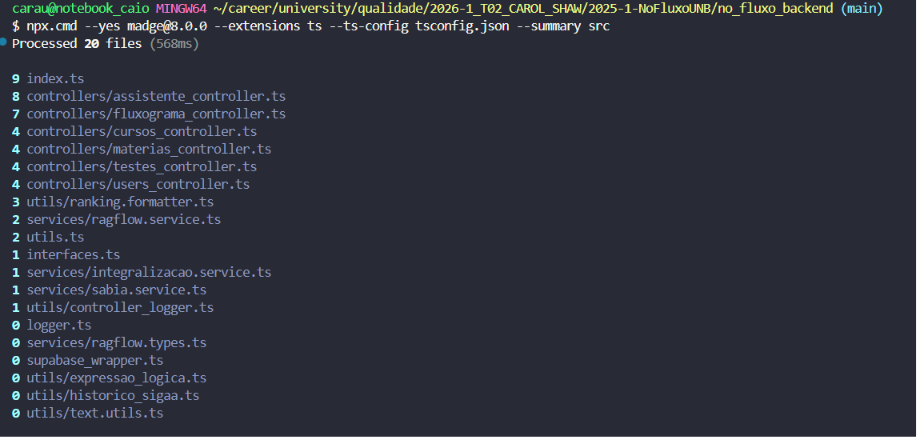
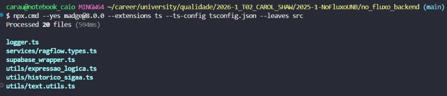
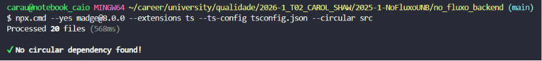

# Evidência da M5

Esta página apresenta a análise estática utilizada no cálculo da **M5 - Condensabilidade** no backend TypeScript.

## 1. Escopo

A unidade de análise correspondeu a cada arquivo `.ts` de produção localizado em [`no_fluxo_backend/src/`](https://github.com/unb-mds/2025-1-NoFluxoUNB/tree/ba6db878b9dfa36fb034916612c4cf58ddf43475/no_fluxo_backend/src). Foram excluídos testes, arquivos de declaração, código gerado e dependências externas.

O frontend e os serviços Python não foram incluídos na medida. As ferramentas examinadas não resolveram de forma confiável as importações declaradas nos componentes `.svelte`. No código Python, o [Pydeps](https://pydeps.readthedocs.io/) não construiu o grafo devido à presença de nomes de arquivos iniciados por números e de caminhos com hífen. A restrição ao backend permite reproduzir a coleta diretamente com uma ferramenta consolidada, sem conversões, renomeações ou programas auxiliares.

## 2. Ferramenta

| Ferramenta | Versão | Aplicação |
| :--------- | :----- | :-------- |
| [Madge](https://github.com/pahen/madge) | 8.0.0 | Contagem das dependências internas, identificação dos componentes sem dependências e verificação de ciclos |

<p align="center">Tabela 1 - Ferramenta utilizada na M5. Fonte: Caio Duarte e Gabriel Flores, 2026.</p>

## 3. Procedimento de Execução

Os comandos abaixo reproduzem a coleta em um terminal PowerShell, a partir da raiz do projeto de NoFluxo:

```powershell
npx.cmd --yes madge@8.0.0 --extensions ts --ts-config tsconfig.json --summary src
npx.cmd --yes madge@8.0.0 --extensions ts --ts-config tsconfig.json --leaves src
npx.cmd --yes madge@8.0.0 --extensions ts --ts-config tsconfig.json --circular src
```

O primeiro comando apresenta a quantidade de dependências internas de cada componente; o segundo lista os componentes que não dependem de outros módulos internos; e o terceiro verifica a existência de dependências circulares.

<figure markdown>



<figcaption>

<b>Figura 1 – Resumo das dependências internas do backend</b>
</br>
Fonte: Caio Duarte, 2026.

</figcaption>
</figure>

Para obter o grafo completo em JSON:

```powershell
npx.cmd --yes madge@8.0.0 --extensions ts --ts-config tsconfig.json --json src
```

## 4. Regra de Classificação

Para cada componente \(C\), considerou-se o conjunto \(D(C)\) de módulos internos importados diretamente:

- **sem dependências internas:** \(D(C) = \varnothing\);
- **com dependências internas:** \(D(C) \neq \varnothing\).

As importações de bibliotecas externas não foram contabilizadas, pois a métrica considera exclusivamente as dependências entre componentes do produto.

## 5. Resultado

| Total | Sem dependências internas | Com dependências internas | Relações internas | M5 |
| ----: | ------------------------: | ------------------------: | ----------------: | --: |
| 20 | 6 | 14 | 51 | 30,00% |

<p align="center">Tabela 2 - Resultado da análise de dependências do backend. Fonte: Caio Duarte e Gabriel Flores, 2026.</p>

Os componentes com maior quantidade de dependências internas diretas foram:

| Componente | Dependências internas diretas |
| :--------- | ----------------------------: |
| [`index.ts`](https://github.com/unb-mds/2025-1-NoFluxoUNB/blob/ba6db878b9dfa36fb034916612c4cf58ddf43475/no_fluxo_backend/src/index.ts) | 9 |
| [`controllers/assistente_controller.ts`](https://github.com/unb-mds/2025-1-NoFluxoUNB/blob/ba6db878b9dfa36fb034916612c4cf58ddf43475/no_fluxo_backend/src/controllers/assistente_controller.ts) | 8 |
| [`controllers/fluxograma_controller.ts`](https://github.com/unb-mds/2025-1-NoFluxoUNB/blob/ba6db878b9dfa36fb034916612c4cf58ddf43475/no_fluxo_backend/src/controllers/fluxograma_controller.ts) | 7 |
| [`controllers/cursos_controller.ts`](https://github.com/unb-mds/2025-1-NoFluxoUNB/blob/ba6db878b9dfa36fb034916612c4cf58ddf43475/no_fluxo_backend/src/controllers/cursos_controller.ts) | 4 |
| [`controllers/materias_controller.ts`](https://github.com/unb-mds/2025-1-NoFluxoUNB/blob/ba6db878b9dfa36fb034916612c4cf58ddf43475/no_fluxo_backend/src/controllers/materias_controller.ts) | 4 |
| [`controllers/testes_controller.ts`](https://github.com/unb-mds/2025-1-NoFluxoUNB/blob/ba6db878b9dfa36fb034916612c4cf58ddf43475/no_fluxo_backend/src/controllers/testes_controller.ts) | 4 |
| [`controllers/users_controller.ts`](https://github.com/unb-mds/2025-1-NoFluxoUNB/blob/ba6db878b9dfa36fb034916612c4cf58ddf43475/no_fluxo_backend/src/controllers/users_controller.ts) | 4 |

<p align="center">Tabela 3 - Maiores concentrações de dependências internas. Fonte: Caio Duarte e Gabriel Flores, 2026.</p>

## 6. Componentes sem Dependências Internas

O comando `--leaves` identificou os seguintes componentes sem dependências internas:

- [`logger.ts`](https://github.com/unb-mds/2025-1-NoFluxoUNB/blob/ba6db878b9dfa36fb034916612c4cf58ddf43475/no_fluxo_backend/src/logger.ts);
- [`services/ragflow.types.ts`](https://github.com/unb-mds/2025-1-NoFluxoUNB/blob/ba6db878b9dfa36fb034916612c4cf58ddf43475/no_fluxo_backend/src/services/ragflow.types.ts);
- [`supabase_wrapper.ts`](https://github.com/unb-mds/2025-1-NoFluxoUNB/blob/ba6db878b9dfa36fb034916612c4cf58ddf43475/no_fluxo_backend/src/supabase_wrapper.ts);
- [`utils/expressao_logica.ts`](https://github.com/unb-mds/2025-1-NoFluxoUNB/blob/ba6db878b9dfa36fb034916612c4cf58ddf43475/no_fluxo_backend/src/utils/expressao_logica.ts);
- [`utils/historico_sigaa.ts`](https://github.com/unb-mds/2025-1-NoFluxoUNB/blob/ba6db878b9dfa36fb034916612c4cf58ddf43475/no_fluxo_backend/src/utils/historico_sigaa.ts);
- [`utils/text.utils.ts`](https://github.com/unb-mds/2025-1-NoFluxoUNB/blob/ba6db878b9dfa36fb034916612c4cf58ddf43475/no_fluxo_backend/src/utils/text.utils.ts).

<figure markdown>



<figcaption>

<b>Figura 2 – Componentes sem dependências internas identificados pelo Madge</b>
</br>
Fonte: Caio Duarte, 2026.

</figcaption>
</figure>

O comando `--circular` não identificou dependências circulares nos 20 componentes analisados.

<figure markdown>



<figcaption>

<b>Figura 3 – Verificação de dependências circulares no backend</b>
</br>
Fonte: Caio Duarte, 2026.

</figcaption>
</figure>

## 7. Cálculo

$$
M5 = \frac{\text{componentes sem dependências internas}}{\text{total de componentes avaliados}} \times 100
$$

$$
M5 = \frac{6}{20} \times 100 = 30{,}00\%
$$

Conforme os critérios estabelecidos na Fase 2, o resultado foi classificado como **inaceitável**, pois permaneceu abaixo de 50%. Essa classificação aplica-se exclusivamente ao backend TypeScript.

## Histórico de Versões

| Versão | Data       | Descrição                      | Autor(es)                                                     | Revisor(es) | Data de Revisão | Alterações Realizadas |
| ------ | ---------- | ------------------------------ | ------------------------------------------------------------- | ----------- | --------------- | --------------------- |
| 1.0    | 12/06/2026 | Registro do mapa de dependências e cálculo da M5 | [Caio Duarte](https://github.com/caioduart3) | [Gabriel Flores](https://github.com/Gabrielfcoelho) |  |  |
| 1.1    | 12/06/2026 | Restrição da análise ao backend TypeScript e inclusão dos comandos de reprodução | [Caio Duarte](https://github.com/caioduart3) | [Gabriel Flores](https://github.com/Gabrielfcoelho) |  |  |
| 1.2    | 12/06/2026 | Inclusão das capturas da execução do Madge como evidências | [Caio Duarte](https://github.com/caioduart3) | [Gabriel Flores](https://github.com/Gabrielfcoelho) |  |  |
| 1.3    | 13/06/2026 | Alinhamento da redação da fórmula com as Fases 2 e 3 | [Caio Duarte](https://github.com/caioduart3) | [Gabriel Flores](https://github.com/Gabrielfcoelho) |  |  |

