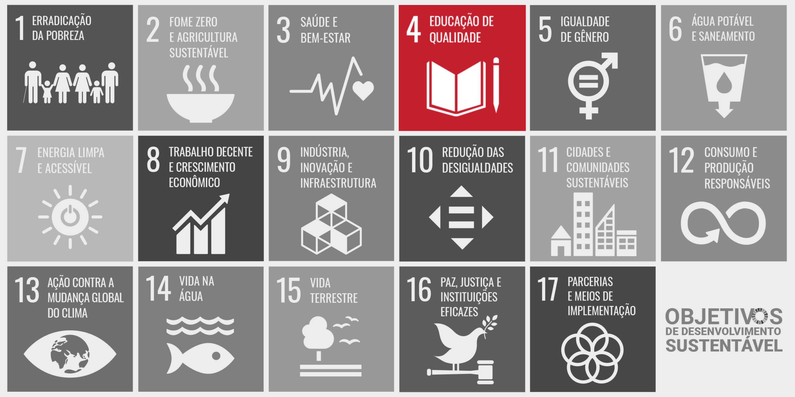

# O Sistema Nofluxo e sua Contribuição para os ODS 

## Introdução

Os Objetivos de Desenvolvimento Sustentável (ODS) foram criados pela Organização das Nações Unidas (ONU) em 2015 como parte da Agenda 2030, um plano global composto por metas e ações voltadas à construção de um mundo mais sustentável, justo e igualitário.

Ao todo, os ODS são formados por <b>17 objetivos</b> que abordam temas fundamentais para o desenvolvimento da sociedade, como podemos observar na <b>figura 1</b>.

Segundo a ONU:

> “Os ODS representam um plano de ação global para eliminar a pobreza extrema e a fome, oferecer educação de qualidade ao longo da vida para todos, proteger o planeta e promover sociedades pacíficas e inclusivas até 2030.”

---

## O que é o ODS 4?

O ODS 4 tem como principal propósito garantir que todas as pessoas tenham acesso a uma educação de qualidade, capaz de desenvolver conhecimentos, habilidades e competências fundamentais para a vida pessoal, profissional e social.

Dentro do conjunto de objetivos, destaca-se o <b>ODS 4</b>, na qual o NoFluxo é aderente, este é responsável por promover a <b>Educação de Qualidade</b>. O objetivo busca assegurar uma educação inclusiva, equitativa e acessível para todos, além de incentivar oportunidades de aprendizagem ao longo da vida.

<figure markdown>

{ width="600" }

<figcaption>

<b>Figura 1 – Objetivos de Desenvolvimento Sustentável (ODS)</b>
 
Fonte: Organização das Nações Unidas (ONU), 2015.

</figcaption>
</figure>

### Metas do ODS 4 e relação ao Sistema NoFluxo

O Sistema NoFluxo apresenta alinhamento com algumas metas específicas do <b>ODS 4 — Educação de Qualidade</b>, principalmente aquelas relacionadas ao ensino superior, inclusão digital, tecnologia e modernização educacional, estas entre todas as metas estão marcadas como `✓`.

??? info "Meta 4.1 — Educação básica de qualidade"

    Até 2030, garantir que todas as meninas e meninos completem o ensino fundamental e médio, equitativo e de qualidade, na idade adequada, assegurando a oferta gratuita na rede pública e que conduza a resultados de aprendizagem satisfatórios e relevantes.

??? info "Meta 4.2 — Desenvolvimento na primeira infância"

    Até 2030, assegurar a todas as meninas e meninos o desenvolvimento integral na primeira infância, acesso a cuidados e à educação infantil de qualidade, de modo que estejam preparados para o ensino fundamental.

??? success "Meta 4.3 — Acesso ao ensino técnico e superior"

    Até 2030, assegurar a equidade (gênero, raça, renda, território e outros) de acesso e permanência à educação profissional e à educação superior de qualidade, de forma gratuita ou a preços acessíveis.

??? success "Meta 4.4 — Competências para trabalho, tecnologia e empreendedorismo"

    Até 2030, aumentar substancialmente o número de jovens e adultos que tenham as competências necessárias, sobretudo técnicas e profissionais, para o emprego, trabalho decente e empreendedorismo.

??? success "Meta 4.5 — Inclusão e igualdade na educação"

    Até 2030, eliminar as desigualdades de gênero e raça na educação e garantir a equidade de acesso, permanência e êxito em todos os níveis, etapas e modalidades de ensino para os grupos em situação de vulnerabilidade.

??? info "Meta 4.6 — Alfabetização e conhecimentos básicos"

    Até 2030, garantir que todos os jovens e adultos estejam alfabetizados, tendo adquirido os conhecimentos básicos em leitura, escrita e matemática.

---

## Justificativa

O <b>Sistema Nofluxo</b> conecta-se diretamente ao ODS 4 ao utilizar a tecnologia como ferramenta para ampliar o acesso ao conhecimento, otimizar processos educacionais e promover uma experiência de aprendizagem mais eficiente, moderna e acessível.

Por meio de soluções digitais, o sistema contribui para a transformação da educação, oferecendo recursos que facilitam:

- A organização e o compartilhamento de informações relacionadas aos fluxos dos cursos da Universidade de Brasília;
- A visualização e o planejamento da trajetória acadêmica dos estudantes;
- A escolha de grades horárias mais aderentes às necessidades e objetivos do usuário;
- A simplificação do processo de montagem de matrícula;
- A democratização digital do acesso às informações acadêmicas para diferentes cursos e perfis de estudantes;

Dessa forma, o Nofluxo fortalece práticas educacionais mais dinâmicas e alinhadas às necessidades da sociedade contemporânea.

Além disso, o sistema auxilia na democratização do acesso à informação, permitindo que conteúdos e processos sejam disponibilizados de maneira rápida, prática e acessível. 

Essa digitalização favorece a inclusão tecnológica e contribui para o desenvolvimento de competências digitais, cada vez mais necessárias no mercado de trabalho e na vida cotidiana.

---

## Referências

> UNICEF Brasil. <b>Objetivos de Desenvolvimento Sustentável</b>. Disponível em:  
  <https://www.unicef.org/brazil/objetivos-de-desenvolvimento-sustentavel>. Acesso em: 12 maio 2026.

> Instituto de Pesquisa Econômica Aplicada (IPEA). <b>ODS 4 – Educação de Qualidade</b>. Disponível em:  
  <https://www.ipea.gov.br/ods/ods4.html>. Acesso em: 12 maio 2026.

## Histórico de Versões

| Versão | Data       | Descrição                      | Autor(es)                                                     | Revisor(es) | Data de Revisão | Alterações Realizadas |
| ------ | ---------- | ------------------------------ | ------------------------------------------------------------- | ----------- | --------------- | --------------------- |
| 1.0    | 12/05/2026 | Escrita da página | [Caio Duarte](https://github.com/caioduart3) |             |                 |                       |
